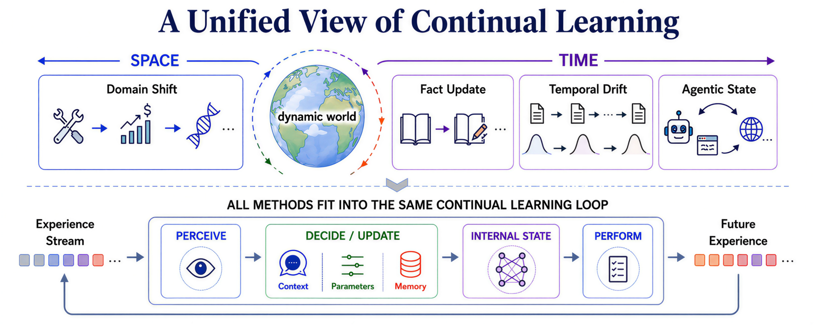

# When Does Continual Learning Require Learning

Anne Harrington¹\*, Nayan Saxena², Michael Murphy¹, Anastasia Borovykh³, Zeyu Yun¹,
Sridhar Kamath², Ara Eindra Kyi², Trevor Darrell¹, Jitendra Malik¹, Yutong Bai¹\*

UC Berkeley¹ &nbsp;·&nbsp; Independent² &nbsp;·&nbsp; Capital Fund Management³

\*Equal contribution

Methods for continual learning in large language models — prompting, fine-tuning,
reinforcement learning, and context compression — are usually studied in isolation.
We propose a framework that lets us evaluate them together on the same sequential
benchmarks, and find that the data and task conditions determine whether continual
learning requires learning.

[](assets/unified-cl-banner.png)

[Project Page](https://anneharrington.github.io/studying-cl/index.html) | [arXiv](https://arxiv.org/abs/2607.07847)

* * *

This is the unified code for the paper. We evaluate **eight methods across four families**
on the **same sequential benchmarks**, on a Qwen3-8B backbone. The code is organized
**by method family**, with a shared evaluation library (`cl/`) so every method is
measured on identical tasks.

## Methods × tasks

|  | Domain shift<br>(ToolUse → FinQA → SciKE-Bio) | Temporal drift<br>(SEC 10-K, 2015–2020) | Discrete updates<br>(TemporalWiki) |
|---|:---:|:---:|:---:|
| **Prompt-based** — GEPA, ACE | ✓ | ✓ | ✓ |
| **Offline weight** — SFT, SDFT | ✓ | ✓ | ✓ |
| **Online weight** — GRPO, SDPO | ✓ | ✓ | ✓ |
| **Compression** — Cartridges, In-Place TTT | ✓ | ✓ | ✓ |

## Layout

```
cl/                     shared library: task registry, eval harnesses, utils
  tasks.py              TASK_REGISTRY (loaders / metrics / per-method hooks)
  evals/                one eval module per task (tooluse, finqa, sciknoweval_bio,
                        finance_yr, sentiment10k, temporalwiki, …)
  utils/                logging, metrics, plotting
methods/
  prompt_based/         GEPA, ACE, OpenEvolve runners + per-task programs + ace/
  offline_weight/       SFT, SDFT  (verl configs — see README there)
  online_weight/        GRPO, SDPO (verl configs — see README there)
  compression/          cartridges/  in_place_ttt/   (vendored, own envs)
engine/verl/            the patched verl engine (drives all weight-update methods)
configs/                methods/ tasks/ runs/ models/  (composable run configs)
data/prep/              dataset builders (finance, temporalwiki → verl parquet)
experiments/            continual sweeps + cartridges/TTT run-chains (templates)
scripts/                run.py (prompt entry), verl_training.sh, launchers, helpers
envs/                   per-subsystem requirements (see docs/SETUP.md)
```

## Environments

The three subsystems have **conflicting dependency pins**, so each gets its own venv —
do **not** install them together. See **[docs/SETUP.md](docs/SETUP.md)**.

| Subsystem | Methods | Requirements |
|---|---|---|
| harness | GEPA, ACE, OpenEvolve + all eval | `envs/requirements-harness.txt` / `pip install -e .` |
| verl | SFT, SDFT, GRPO, SDPO | `envs/requirements-verl.txt` (GPU) |
| cartridges | Cartridges | `envs/requirements-cartridges.txt` |
| ttt | In-Place TTT | `envs/requirements-ttt.txt` |

## Quickstart

One entry point for every method × task family:

```bash
./run.sh <method> <task_family>

./run.sh gepa       domain_shift        # prompt-based
./run.sh sdpo       temporal_drift      # weight update (verl, GPU)
./run.sh sft        domain_shift
./run.sh cartridges discrete_updates    # compression
```

- **methods:** `gepa ace` · `sft sdft grpo sdpo` · `cartridges in_place_ttt`
- **task families:** `domain_shift` · `temporal_drift` · `discrete_updates`

`run.sh` activates the right per-subsystem venv (`.venv-<name>`, see
[docs/SETUP.md](docs/SETUP.md)) and routes to the method's backend (prompt →
`scripts/run.py`; weight → `experiments/continual/run_sequential.py`; compression →
`experiments/*/run_chain.sh`). Anything after the task family passes through to that
backend, e.g. `./run.sh sdpo domain_shift --seed 7` or `./run.sh gepa domain_shift
--eval-n 50`.

## Data

`data/prep/` builds the verl-format parquets for finance & TemporalWiki;
`scripts/download_data.sh` pulls the public eval datasets. See
**[docs/TASKS.md](docs/TASKS.md)**.

## Acknowledgements

This codebase builds on several open-source projects, vendored under `engine/` and
`methods/` with their licenses.

- **Weight-update methods** run on [verl](https://github.com/volcengine/verl). The
  SDPO and SDFT self-distillation implementations come from the
  [SDPO](https://github.com/lasgroup/SDPO) (Hübotter et al.) and
  [Self-Distillation / SDFT](https://github.com/idanshen/Self-Distillation)
  (Shenfeld et al.) repositories, which build on verl; `engine/verl/` carries their
  changes (GRPO is verl's own).
- **Prompt-based methods:** [GEPA](https://github.com/gepa-ai/gepa),
  [ACE](https://github.com/sci-m-wang/ACE),
  [OpenEvolve](https://github.com/algorithmicsuperintelligence/openevolve).
- **Compression methods:** [Cartridges](https://github.com/HazyResearch/cartridges)
  and In-Place TTT.

## Citation

If you find this work useful, please cite:

```bibtex
@misc{harrington2026continual,
      title={When Does Continual Learning Require Learning}, 
      author={Anne Harrington and Nayan Saxena and Michael Murphy and Anastasia Borovykh and Zeyu Yun and Sridhar Kamath and Ara Eindra Kyi and Trevor Darrell and Jitendra Malik and Yutong Bai},
      year={2026},
      eprint={2607.07847},
      archivePrefix={arXiv},
      primaryClass={cs.LG},
      url={https://arxiv.org/abs/2607.07847}, 
}
```
